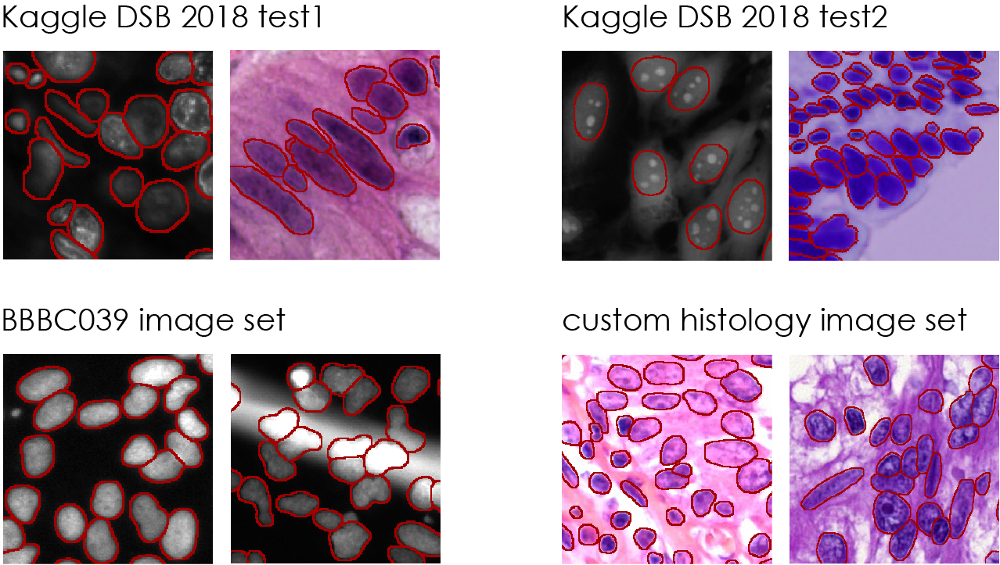

# Intro

This repository contains the codes to run the nuclei segmentation pipeline of the BIOMAG group inspired by Kaggle's Data Science Bowl 2018 competition

Some resulting masks obtained by our method:



# Prerequisites

Please see requirements.txt that can also be run as a bash script (Linux) or alternatively, you can copy the install commands to console corresponding to your system (command prompt (Windows) / terminal (Linux)) and execute them.

- Install CUDA 9.0 and CuDNN 7.0 as well as MATLAB* (Release 2017a or later) appropriate for your system. Currently, Linux and Windows implementation is provided.

	\*: MATLAB is not required for [fast prediction](#fast-prediction).

- MATLAB* toolboxes used by the repository are:
	- Image Processing Toolbox
	- Parallel Computing Toolbox
	- Statistics and Machine Learning Toolbox
	- Curve Fitting Toolbox
	- Global Optimization Toolbox
	- Optimization Toolbox
- See requirements.txt for python packages to install.
- Download Matterport's Mask R-CNN github repository or clone directly with git and revert to the commit our method uses:

```
	git clone https://github.com/matterport/Mask_RCNN.git
	git checkout 53afbae5c5159b5a10ecd024a72b883a2b058314
```

- You will need to set the path of your cloned Mask R-CNN folder in the scripts below
- See documentation in .pdf on how to use functionalities of our pipeline

## Data

Our method expects images to be 8-bit 3 channels RGB images in .png format. See [our script](#preprocess-test-images) to convert your images.


# Prediction

Download our pre-trained models from [our google drive](https://drive.google.com/open?id=1lVJtS41vzMkIsCa3-i14mSmLBbaKazsq)

- Make sure you have *mask_rcnn_coco.h5*, *mask_rcnn_presegmentation.h5* and *mask_rcnn_final.h5* in the folder \kaggle_workflow\maskrcnn\model\
- Make sure you have *UNet_sigma0.0_1\UNet_sigma0.0_1* and the other U-Net models in the folder \kaggle_workflow\unet\

You can choose either full prediction with post-processing or fast prediction; the former takes longer to complete and requires more VRAM.


## **Full prediction pipeline with post-processing**

Predicts nuclei first with a presegmenter Mask R-CNN model, estimates cell sizes, predicts with multiple U-Net models and ensembles the results, then uses all of the above in a final post-processing step to refine the contours.
To predict nuclei on images please edit either

- `start_prediction_full.bat` (Windows) or 
- `start_prediction_full.sh` (Linux)

and specify the following 3 directories with their corresponding full paths on your system:

- Mask R-CNN
- root_dir
- images_dir

Note: [pre-processing scripts](#preprocess-test-images) are provided to convert your test images.
See further details in the documentation.

## **Fast prediction**

Predicts nuclei with a presegmenter Mask R-CNN model that generalizes and performs well in varying image types. Produces fast results that can be improved with the post-processing option above.
To predict fast:
Please follow the steps of "PREDICTION WITH POST-PROCESSING" section for either of the files:

- `start_prediction_fast.bat` (Windows) or 
- `start_prediction_fast.sh` (Linux)

See further details in the documentation.


# Custom validation

To use your custom folder of images as validation please run the following script according to your operating system:

- `runGenerateValidationCustom.bat` (Windows)
- `runGenerateValidationCustom.sh` (Linux)

See further details in the documentation.


# Training

Obtain our pre-trained classifier *pretrainedDistanceLearner.mat* for training by either:
- Downloading it from [our google drive](https://drive.google.com/drive/folders/1RC4Iy3qkfU1cF6bZFx3JOXvzqsvyT3J4?usp=sharing). Make sure you have *pretrainedDistanceLearner.mat* in the folder \kaggle_workflow\inputs\clustering\

	***or***

- Installing Git LFS (Large File Storage) by following the instructions on [their installation guide](https://github.com/git-lfs/git-lfs/wiki/Installation) or [their github page](https://git-lfs.github.com/) according to your operating system. Make sure you set it up after installation:

	```
		git lfs install
	```

WARNING: it is possible to overwrite our provided trained models in this step. See documentation for details.

We include a .mat file with the validation image names we used for the Kaggle DSB2018 competition. If you would like to use your own images for this pupose, see [**Custom validation**](#custom-validation) above.

WARNING: training will override the U-Net models we provide, we advise you make a copy of them first from the following relative path:
\kaggle_workflow\unet\

To train on your own images please run the following script according to your operating system:

- `start_training.bat` (Windows)
- `start_training.sh` (Linux)

NOTE: for Windows you need to edit start_training.bat and set your python virtual environment path as indicated prior to running the script. It will open a second command prompt for necessary server running of pix2pix and must remain open until all pix2pix code execution is finished - which is indicated by the message "STYLE TRANSFER DONE:" in command prompt.

See further details in the documentation.


# Parameter search for post-processing

A generally optimal set of parameters are provided in the scripts as default. However, you can run our parameter optimizer to best fit to your image set.

To find the most optimal parameters please run the following script according to your operating system:

- `start_parameterSearch.bat` (Windows)
- `start_parameterSearch.sh` (Linux)

and see the found parameters in the text file \kaggle_workflow\outputsValidation\paramsearch\paramsearchresult.txt

See further details in the documentation.


# Prepare style transfer input for single experiment

To prepare style transfer on your own images coming from **the same experiment** please run the following script according to your operating system:

- `start_singleExperimentPreparation.bat` (Windows)
- `start_singleExperimentPreparation.sh` (Linux)

After this you are ought to run *these* training scripts instead of the ones above:

- `start_training_singleExperiment.bat` (Windows)
- `start_training_singleExperiment.sh` (Linux)

as these scripts would use the single experiment data for style transfer learning.

WARNING: If you do not provide your own mask folder for this step the default option will be \kaggle_workflow\outputs\presegment which is created by the fast segmentation step of our pipeline. Please run it prior to this step to avoid 'file not found' errors.

NOTE: This option should only be used if **all your images come from the same experiment**. If you provide mixed data, subsequent style transfer learning will result in flawed models and failed synthetic images.


# Preprocess test images

If your test images are 16-bit you may want to convert them to 8-bit 3 channel images with either

- `start_image_preprocessing.bat` (Windows)
- `start_image_preprocessing.sh` (Linux)


# Citation

Please cite our paper if you use our method:

Reka Hollandi, Abel Szkalisity, Timea Toth, Ervin Tasnadi, Csaba Molnar, Botond Mathe, Istvan Grexa, Jozsef Molnar, Arpad Balind, Mate Gorbe, Maria Kovacs, Ede Migh, Allen Goodman, Tamas Balassa, Krisztian Koos, Wenyu Wang, Juan Carlos Caicedo, Norbert Bara, Ferenc Kovacs, Lassi Paavolainen, Tivadar Danka, Andras Kriston, Anne Elizabeth Carpenter, Kevin Smith, Peter Horvath (2020): “**nucleAIzer: a parameter-free deep learning framework for nucleus segmentation using image style transfer**”, *Cell Systems*, Volume 10, Issue 5, 20 May 2020, Pages 453-458.e6

